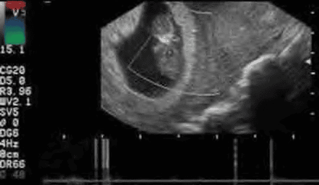
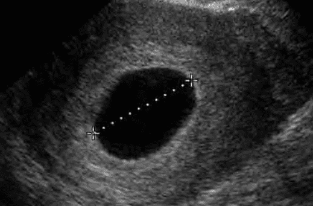
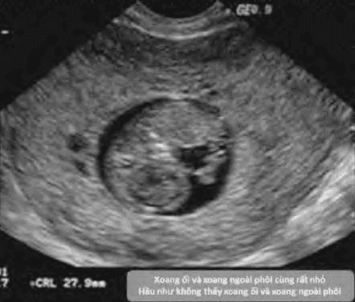
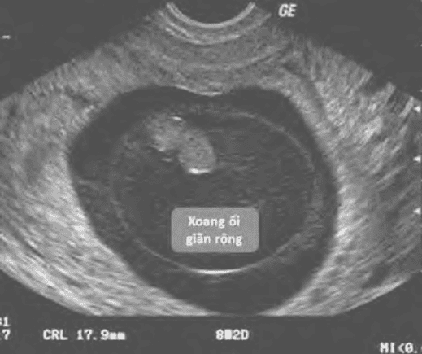
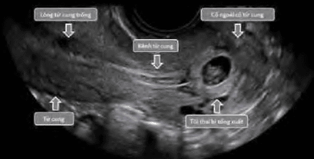
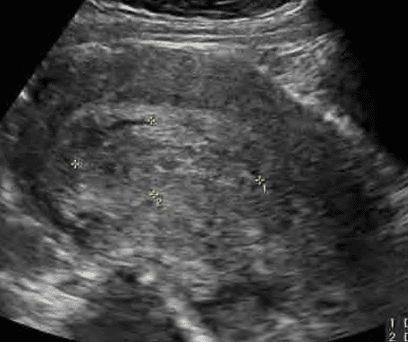
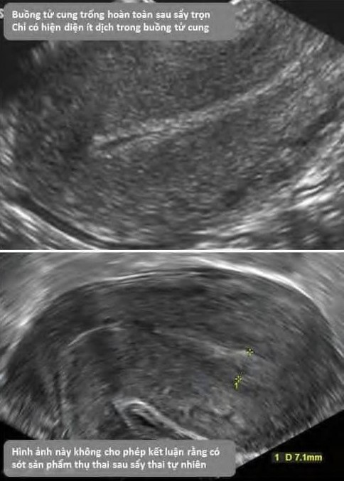

Thai nghén thất bại sớm (Early Pregnancy Failure) thường được biết dưới dạng trứng trống (blighted ovum) hoặc thai ngưng phát triển (embryonic demise). Tình trạng này xảy ra trước 12 tuần tuổi thai và ảnh hưởng tới khoảng 10–15% các thai lâm sàng, với nguyên nhân chủ yếu do bất thường nhiễm sắc thể, rối loạn nội mạc tử cung hoặc bệnh lý toàn thân của người mẹ.

## Định nghĩa

1. **Thai sinh hóa** (biochemical pregnancy): Chỉ hiện diện độc lập của β-hCG trong huyết thanh mà không có dấu hiệu chắc chắn của thai qua khám hoặc siêu âm. Thai sinh hóa có thể tiến triển thành thai lâm sàng hoặc thất bại sớm.
2. **Thai lâm sàng** (clinical pregnancy): Chỉ các thai kỳ được xác định qua khám lâm sàng hoặc hình ảnh siêu âm. Trong thai lâm sàng, nếu phát triển phôi sau làm tổ rồi ngưng phát triển, gọi là thai nghén thất bại sớm.
3. **Trứng trống** (blighted ovum): Chỉ sự hiện diện của túi thai nhưng không thấy phôi thai bên trong.
4. **Thai ngưng phát triển** sớm: Chỉ hình ảnh túi thai có phôi nhưng không có hoạt động tim thai.

:::caution
Thai nghén thất bại sớm không bao gồm thai sinh hóa.
:::

## Chẩn đoán

Triệu chứng lâm sàng thường bao gồm ra **huyết âm đạo** và **đau bụng âm ỉ**.

:::note[Tiêu chuẩn chẩn đoán thai nghén thất bại sớm]
The Society of Radiologists in Ultrasound Multispecialty Panel, chẩn đoán thai kỳ thất bại khi siêu âm qua đường âm đạo đáp ứng ≥ 1 tiêu chí sau:

1. Chiều dài từ đỉnh đầu đến mông (CRL) ≥ 7 mm mà không có tim thai.
2. Đường kính túi trung bình (MSD) ≥ 25 mm mà không có phôi thai.
3. Không có phôi có nhịp tim sau ≥ 14 ngày kể từ khi siêu âm thấy túi thai không có túi noãn hoàng.
4. Không có phôi có nhịp tim sau ≥ 11 ngày kể từ khi siêu âm thấy túi thai có túi noãn hoàng.

**Tiêu chuẩn rõ nhất là CRL ≥ 7 mm không thấy tim thai**. Nếu CRL < 7 mm và không thấy tim, phải chờ tái siêu âm.
:::

_Hình ảnh "Thai ngưng phát triển: Phôi với CRL ≥ 7 mm không có tim phôi (xác nhận bằng phổ Doppler)"._

Để **chẩn đoán trứng trống**, không đủ khi chỉ không thấy phôi hoặc túi noãn hoàng với MSD < 25 mm. **Phải có MSD ≥ 25 mm không thấy phôi hoặc túi noãn hoàng**.

_Hình ảnh "Trứng trống: MSD ≥ 25 mm không thấy túi noãn hoàng hay phôi"._

**Các tình huống nghi ngờ khác (chưa đủ tiêu chuẩn)** gồm:

- Phôi CRL < 7 mm không hoạt động tim phôi.
- MSD 16–24 mm không có phôi.
- Không thấy phôi có tim sau 7–10 ngày từ khi phát hiện túi thai và túi noãn hoàng.
- Không có màng ối rõ sau 6 tuần vô kinh.
- Yolk-sac giãn > 7 mm.
- Hiệu (MSD – CRL) < 5 mm.

:::caution
Nếu nghi ngờ, phải tái siêu âm tối thiểu 7 ngày sau lần đầu trước khi chẩn đoán chắc chắn (NICE).
:::

## Phân loại

Các trường hợp trên lâm sàng:

- Thai chết lưu (missed miscarriage).
- Dọa sảy thai lưu (threatened miscarriage).
- Sảy thai khó tránh (inevitable miscarriage).
- Sảy thai không trọn (incomplete miscarriage).
- Sảy thai trọn (complete miscarriage).

### Thai lưu

- **Siêu âm xác nhận** khi:
  1. CRL ≥ 7 mm không thấy tim thai.
  2. MSD ≥ 25 mm không thấy phôi thai.
  3. Phôi không xuất hiện sau 14 ngày kể từ siêu âm xác nhận túi thai không có yolk-sac.
  4. Không thấy tim thai qua ≥ 2 lần siêu âm cách nhau 7–10 ngày.
- **Không dùng β-hCG để chẩn đoán thai lưu** vì không phản ánh tính sinh tồn của phôi.

### Dọa sảy thai lưu

- Nguyên nhân thường là **bất thường nhiễm sắc thể** và khó ngăn chặn sự phát triển thành thai lưu.
- **Ra máu, đau bụng, cổ tử cung đóng**.
- **Dấu hiệu siêu âm dự báo (không khẳng định)** bao gồm:
  - Không thấy phôi sau 6 tuần vô kinh.
  - Yolk-sac giãn > 7 mm.
  - (MSD – CRL) < 5 mm. 
    _Hình ảnh "Doạ sảy thai lưu: Túi thai rất nhỏ, (MSD-CRL) < 5mm, có tụ máu dưới màng đệm"._
    
  - Tim thai chậm < 80–90 nhịp/phút.
  - Xuất huyết dưới màng nuôi.
  - Xoang ối giãn rộng (expanded amnion sign). 
    _Hình ảnh "Doạ sảy thai lưu: Xoang ối giãn rộng, không tương xứng với phôi rất nhỏ bên trong. Tiên lượng xấu nhưng không cho phép kết luận thai nghén thất bại sớm"._
    

### Sảy thai khó tránh

- **Ra máu kèm mở cổ tử cung** khi thai vẫn còn trong buồng tử cung.
- Cần phân biệt với thai ngoài tử cung ở cổ tử cung bằng β-hCG và siêu âm. 
  _Hình ảnh "Sảy thai khó tránh: Thai vẫn nằm trong cổ tử cung, cổ tử cung mở"._
  

### Sảy thai không trọn

- Ra huyết rỉ rả, đau quặn bụng, cổ tử cung hé mở, siêu âm thấy khối echo hỗn hợp trong lòng tử cung. 
  _Hình ảnh "Sảy thai không trọn: Cấu trúc echo hỗn hợp trong buồng tử cung"._
  

### Sảy thai trọn

- Hoàn toàn tống xuất mô thai, cổ tử cung đóng, siêu âm buồng tử cung rỗng hoặc chỉ có ít dịch. 
  _Hình ảnh "Sảy thai trọn: Lòng tử cung trống sau sảy thai trọn"._
  

## Điều trị

Có 3 lựa chọn chính:

1. Theo dõi diễn tiến. Phù hợp sảy thai không trọn, tỷ lệ thành công 90% nhưng thời gian kéo dài.
2. Điều trị nội khoa bằng misoprostol. Khuyến cáo 800 µg đặt âm đạo khởi đầu, có thể lặp lại nếu cần.
3. Hút lòng tử cung. Thực hiện nhanh, ít mất máu, nhưng có nguy cơ thủng tử cung và nhiễm trùng.
   Khi chọn theo dõi, cần tái siêu âm và có thể đo β-hCG để đánh giá giảm nồng độ (> 80% sau 1 tuần).

## Nguồn tham khảo

- Trường ĐH Y Dược TP. HCM (2020) – _Team-based learning_
- Perinatology – [_Beta hCG Doubling Time Calculator_](https://perinatology.com/calculators/betahCG.htm)
