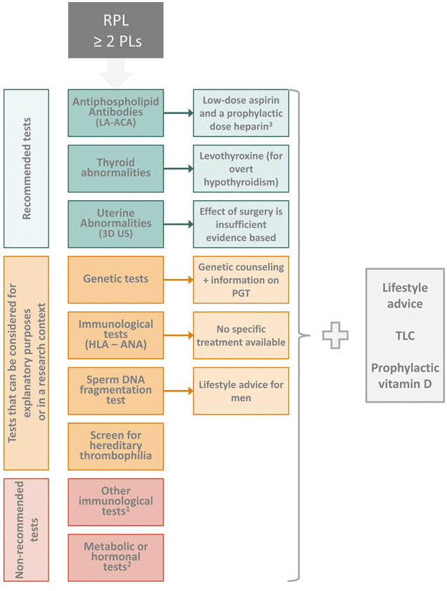

Thai nghén thất bại sớm liên tiếp (Recurrent Pregnancy
Loss - RPL) được xác định khi thai nghén bị thất bại từ 2 lần trở lên, không bao gồm thai ngoài tử cung hay thai trứng.

Thai nghén thất bại sớm được định nghĩa khi thai kì sụp đổ tự phát trước khi thai nhi có khả năng sinh sống. Mốc này thường được xác nhận ở 24 tuần tuổi thai vô kinh. Mặc dù có những trường hợp ghi nhận sự sống sót của thai nhi trước 24 tuần do tiến bộ của sơ sinh nhưng không phải là phổ biến nên định nghĩa này có thể thay đổi tùy theo quốc gia.

Có sự phân biệt giữa RPL nguyên phát và RPL thứ phát:

- RPL nguyên phát xảy ra mà không có thai kì nào vượt qua 24 tuần trước đó.
- RPL thứ phát xảy ra sau hoặc nhiều thai kì trên 24 tuần.

## Yếu tố nguy cơ

### Tuổi

Lớn tuổi luôn luôn là yếu tố nguy cơ trong sản khoa, liên quan mật thiết đến nhiều vấn đề: vô sinh, dị tật thai, thai chết lưu, biến chứng sản khoa...

Có nhiều chứng cứ cho thấy phụ nữ dưới 30 tuổi có nhiều cơ hội thành công sau RPL hơn phụ nữ trên 30 tuổi. Phụ nữ trên 35 tuổi tăng gấp đôi nguy cơ mất thai sau RPL và trên 35 tuổi được xác định là mốc có ý nghĩa thống kê về nguy cơ bất thường nhiễm sắc thể ở RPL thường xuyên và tái phát.

Tuổi cha có mối liên quan với sảy thai tuy nhiên không có chứng cứ trực tiếp cho thấy mối liên quan này với RPL. European Society of Human Reproduction and Embryology (ESHRE) khuyến cáo như sau (chứng cứ mức độ mạnh) Phụ nữ cần được thông báo rằng nguy cơ mất thai ít nhất ở độ tuổi 20-35. Nguy cơ mất thai tăng cao sau 40 tuổi.

### Stress

Stress có liên quan đến RPL nhưng stress không được xác định là nguyên nhân trực tiếp gây ra RPL.

### Môi trường và nghề nghiệp

Hiện tại chỉ có vài nghiên cứu nhỏ chỉ ra rằng các yếu tố nghề nghiệp và môi trường tiếp xúc (thuốc trừ sâu, kim loại nặng, thiếu vi chất) làm tăng RPL tuy nhiên chưa có đủ chứng cứ chống lại các yếu tố nghề nghiệp và môi trường phơi nhiễm.

### Viêm mạn nội mạc tử cung

Có nhiều nghiên cứu chỉ ra mối liên quan giữa viêm mạn nội mạc tử cung và tăng nguy cơ RPL tuy nhiên cần có thêm nhiều nghiên cứu quan sát cũng như đối chứng ngẫu nhiên trước khi tiến hành tầm soát thường quy cho RPL. Các nghiên cứu về microbiota của buồng tử cung cũng ủng hộ luận điểm này.

Bất thường màng rụng hóa nội mạc tử cung: cơ chế thay đổi nội mạc tử cung trong giai đoạn sớm của thai kì cũng như trong suốt chu kì kinh nguyệt chưa được hiểu thấu đáo. Các tế bào nội mạc tử cung dường như tạo thành trạm kiểm soát chất lượng phôi dẫn đến quá trình làm tổ thành công ở các phôi bình thường và sự sụp đổ nhanh chóng ở các trường hợp phôi bất thường. Quan sát gần đây trên các trường hợp RPL cho rằng
nội mạc tử cung có thể nhạy cảm quá mức trong việc kiểm soát làm tổ của phôi (bất thường trạm kiểm soát) nhưng cần nghiên cứu thêm trước khi có kết luận hoặc xây dựng các khuyến cáo cho lâm sàng.

### Hút thuốc lá, béo phì và uống rượu

Làm giảm cơ hội có trẻ sinh sống và ảnh hưởng tiêu cực đến kết cục của thai kì.

## Tiếp cận

### Khảo sát vật chất di truyền

Bất thường vật chất di truyền của phôi là yếu tố quan trọng nhất gây RPL.

Có 2 loại bất thường phổ biến nhất trong thời kì thai sớm: bất thường về phát triển và bất thường về di truyền. Những bất thường này chiếm 86-91% các trường hợp sảy thai sớm có mô thai. Xác định di truyền của mô thai từ phụ nữ có RPL có thể cung cấp cho họ nguyên nhân hoặc lý do cụ thể tuy nhiên không giúp loại trừ các tình trạng bệnh dưới chưa được xác định. Khuyến cáo làm array-CGH vì hạn chế nhiễm chéo từ mẹ.

Bất thường di truyền bố mẹ chỉ chiếm 1.9-3.5% các cặp vợ chồng có RPL. Các bất thường quan trọng là chuyển đoạn Robertson, đảo đoạn, vi mất đoạn, mất đoạn, đột biến...

Karyotype bố mẹ không được khuyến cáo thường quy, chỉ làm khi có yếu tố nguy cơ từ bố, mẹ: có tiền sử sinh con bị dị tật bẩm sinh, phát hiện mất cân bằng bộ nhiễm sắc thể ở những đứa trẻ trong gia đình hoặc phát hiện chuyển đoạn trong mô thai bị mất. Các cặp vợ chồng nên được thông báo hạn chế của làm karyotype: không tiên lượng được chuyển đoạn cho thai kì tiếp theo, dù bất thường được tìm ra thì cơ hội có đứa trẻ khỏe mạnh là hoàn toàn khả thi..., để các cặp vợ chồng cân nhắc việc tiếp tục cố gắng thụ thai, ngừng cố gắng hay lựa chọn các xét nghiệm xâm lấn tiền làm tổ (PGT).

Bất thường vật chất di truyền của giao tử là nguyên nhân trực tiếp, xảy ra trong meiosis tạo giao tử. Tầm soát bất thường di truyền giao tử và phôi thể hiện qua hợp tử, và có thể phát hiện bằng khảo sát tiền làm tổ (PGT):

1. Noãn: lệch bội, bất thường DNA ti thể.
2. Tinh trùng: lệch bội, đứt gãy DNA.
3. Phôi: lệch bội, bất thường thượng di truyền.

### Khảo sát tăng đông

Thrombophilia là tình trạng di truyền hay mắc phải trong đó phụ nữ có RPL dễ có huyết khối tĩnh mạch (tắc mạch và thuyên tắc phổi).

Tầm soát Thrombophilia truyền: không khuyến cáo tầm soát thường quy. Chỉ thực hiện khi có yếu tố nguy cơ gia đình.

Thrombophilia mắc phải (hội chứng kháng phospholipid - APS): Lupus anticoagulant (LA) và Anticardiolipin antibodies (ACAIgG và IgM) là khuyến cáo có chứng cứ mạnh, β2 Glycoprotein 1 antibodies cân nhắc thực hiện ở những phụ nữ có RPL.

### Tầm soát miễn dịch

Các khảo sát tầm soát miễn dịch gồm HLA và HLA antibodies, Anti-HY antibodies, Cytokine và Cytokine polymorphism, Antinuclear antibodies không được khuyến cáo trong thực hành lâm sàng. Các khảo sát này chỉ được cân nhắc theo trường hợp.

### Tầm soát nội tiết-chuyển hóa

Hormone tuyến giáp rất cần thiết cho sự phát triển của phôi thai. Những nghiên cứu mới đây chỉ ra rằng rối loạn hormone tuyến giáp và tăng Thyroid peroxidase antibody (TPO-Ab) liên quan đến sự phát triển của vi sinh vật gây bệnh, sinh tinh, thụ tinh và phôi, có vai trò quan trọng của trong khả năng thụ thai và mất thai. Tầm soát TSH và TPO-Ab được khuyến cáo thường quy với phụ nữ có RPL. Bất thường TSH và TPO-Ab nên được theo dõi bằng FT4 (chứng cứ mạnh).

Kháng Insulin được ghi nhận ngày càng nhiều trên phụ nữ có RPL. Tuy nhiên tầm soát PCOS, đường huyết đói, Insulin đói
không khuyến cáo trong thực hành lâm sàng vì chưa có đủ bằng chứng cải thiện tiên lượng cho chu kì tiếp theo.

Prolactin là hormone rất cần thiết trong quá trình sinh sản nữ. Prolactin có thể đóng vai trò quan trọng trong việc duy trì hoàng thể và tiết progesterone mặc dù cơ chế chưa được biết rõ. Khảo sát Prolactin không khuyến cáo nếu không có dấu hiệu lâm sàng của tăng prolactin máu (vô kinh, thiểu kinh, tiết sữa).

Khảo sát sex steroids, androgens, LH, Progesterone pha hoàng thể không khuyến cáo thực hiện thường quy.

Thiếu Vitamin D có liên quan đến RPL. Tuy nhiên thai kì luôn luôn được bổ sung vitamin D.

### Khảo sát giải phẫu học tử cung

| Bất thường giải phẫu tử cung                                                                                    | Điều trị                                                                                                                                   |
| --------------------------------------------------------------------------------------------------------------- | ------------------------------------------------------------------------------------------------------------------------------------------ |
| Tử cung có vách ngăn                                                                                            | Nội soi buồng tử cung cắt vách ngăn                                                                                                        |
| U xơ tử cung                                                                                                    | Nội soi buồng tử cung cắt u xơ dưới niêm hoặc phẫu thuật tối thiểu trên u xơ tử cung có gây biến dạng lòng tử cung trên bệnh nhân chọn lọc |
| Polyp nội mạc tử cung                                                                                           | Nội soi buồng tử cung cắt polyp                                                                                                            |
| Dính buồng tử cung                                                                                              | Nội soi cắt dính và phòng ngừa dính tái phát                                                                                               |
| Các bất thường cấu trúc khác: tử cung đôi, tử cung 2 sừng, tử cung có sừng chột, tử cung đôi có 1 cổ tử cung... | Không khuyến cáo can thiệp vì không có bằng chứng lợi ích rõ ràng                                                                          |

Khảo sát giải phẫu học tử cung được khuyến cáo thực hiện thường quy.

Lựa chọn đầu tay là siêu âm 3D vì độ nhạy và độ chuyên tốt, phân biệt được vách ngăn tử cung và tử cung đôi mà có 1 cổ tử cung.

Siêu âm bơm nước buồng tử cung (SIS) chính xác hơn HSG khi khảo sát bất thường tử cung, có thể kết hợp khảo sát hai vòi trứng, lựa chọn nếu không có sẵn siêu âm 3D. Nếu có dị dạng tử cung nên kết hợp khảo sát thêm hệ niệu. Nếu không có siêu âm 3D có thể lựa chọn thay thế bằng MRI.

### Lược đồ tiếp cận

_Lược đồ tiếp cận thai nghén thất bại sớm liên tiếp._

## Nguồn tham khảo

- TEAM-BASED LEARNING - Trường Đại học Y Dược Thành phố Hồ Chí Minh 2020.
