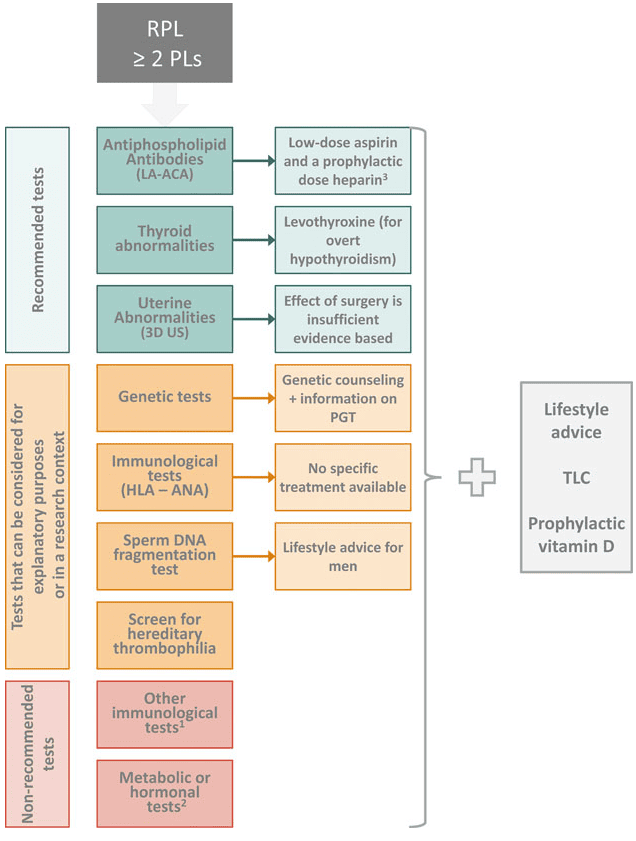

**Thai nghén thất bại sớm liên tiếp (Recurrent Pregnancy Loss - RPL)** được xác định khi thai nghén bị thất bại từ 2 lần trở lên, không bao gồm thai ngoài tử cung hay thai trứng. Thai nghén thất bại sớm được định nghĩa khi thai kỳ sụp đổ tự phát trước khi thai nhi có khả năng sinh sống (thường trước 24 tuần tuổi thai vô kinh). Mốc này có thể thay đổi tùy theo quốc gia và tiến bộ y học. Có sự phân biệt giữa RPL nguyên phát và RPL thứ phát:

- RPL nguyên phát xảy ra mà không có thai kỳ nào vượt qua 24 tuần trước đó.
- RPL thứ phát xảy ra sau hoặc nhiều thai kỳ có con sống trước đó.

## Yếu tố nguy cơ

- **Tuổi**: Lớn tuổi liên quan mật thiết đến vô sinh, dị tật thai, thai chết lưu và RPL. Phụ nữ trên 35 tuổi có nguy cơ mất thai sau RPL tăng gấp đôi và tỷ lệ bất thường nhiễm sắc thể cao hơn. Tuổi cha tuy có liên quan đến sảy thai nhưng chưa chứng minh rõ với RPL.
- **Stress**: Có liên quan đến RPL nhưng không được xác định là nguyên nhân trực tiếp.
- **Môi trường và nghề nghiệp**: Một số nghiên cứu nhỏ gợi ý thuốc trừ sâu, kim loại nặng, thiếu vi chất có thể tăng RPL, nhưng chưa đủ chứng cứ.
- **Viêm mạn nội mạc tử cung**: Viêm mạn và bất thường cơ chế "kiểm soát" làm tổ tại nội mạc tử cung có thể góp phần vào RPL, cần thêm nghiên cứu và dữ liệu đối chứng.
- **Hút thuốc lá, béo phì và uống rượu**: Giảm cơ hội sinh sống và ảnh hưởng tiêu cực đến kết cục thai kỳ.

## Tiếp cận

### Khảo sát vật chất di truyền

- **Bất thường di truyền phôi** chiếm 86–91% RPL. Khuyến cáo **xét nghiệm array-CGH cho mô thai tống xuất** để xác định nguyên nhân, hạn chế nhiễm chéo từ mẹ.
- **Bất thường nhiễm sắc thể ở bố mẹ** (chuyển đoạn, đảo đoạn...) chiếm 1.9–3.5% RPL; chỉ làm karyotype khi có yếu tố nguy cơ gia đình.
- **Tầm soát tiền làm tổ (PGT)** phát hiện lệch bội và bất thường DNA ti thể/phôi.

### Khảo sát tăng đông

- **Thrombophilia di truyền** không khuyến cáo sàng lọc thường quy.
- **Hội chứng kháng phospholipid (APS)** cần xét nghiệm Lupus anticoagulant và anticardiolipin antibodies với chứng cứ mạnh; β2-Glycoprotein 1 antibodies cân nhắc.

### Khảo sát miễn dịch

- HLA, anti-HY, cytokine polymorphism, antinuclear antibodies không khuyến cáo thường quy, chỉ theo trường hợp.

### Khảo sát nội tiết - chuyển hóa

- TSH và TPO-Ab nên sàng lọc định kỳ.
- Bất thường thyroid theo dõi thêm FT₄. Prolactin, insulin, PCOS, sex steroids không khuyến cáo nếu không có dấu hiệu lâm sàng.
- Vitamin D được bổ sung theo khuyến nghị chung.

### Khảo sát giải phẫu tử cung

- Siêu âm 3D là lựa chọn đầu tay, có thể thay thế bằng SIS hoặc MRI nếu cần.
  _Bảng "Bất thường giải phẫu tử cung"._
  | Bất thường giải phẫu tử cung                          | Điều trị                                                                                                   |
  | ----------------------------------------------------- | ---------------------------------------------------------------------------------------------------------- |
  | **Tử cung có vách ngăn**                              | Nội soi buồng tử cung cắt vách ngăn                                                                        |
  | **U xơ tử cung**                                      | Nội soi buồng tử cung cắt u xơ dưới niêm mạc hoặc phẫu thuật tối thiểu trên u xơ có biến dạng lòng tử cung |
  | **Polyp nội mạc tử cung**                             | Nội soi buồng tử cung cắt polyp                                                                            |
  | **Dính buồng tử cung**                                | Nội soi cắt dính và phòng ngừa dính tái phát                                                               |
  | **Các dị dạng khác (tử cung đôi, tử cung 2 sừng...)** | Không khuyến cáo can thiệp do thiếu chứng cứ lợi ích                                                       |
- Khảo sát hệ niệu khi phát hiện dị dạng.

_Bảng "Lược đồ tiếp cận thai nghén thất bại sớm liên tiếp"._

## Nguồn tham khảo

- Trường ĐH Y Dược TP. HCM (2020) – _Team-based learning_
