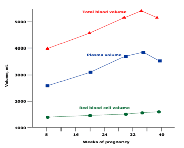

Thiếu máu trong thai kỳ ảnh hưởng đến cả mẹ và con.

## Thay đổi huyết học, tuần hoàn trong thai kỳ

Thể tích huyết thanh bắt đầu tăng từ tuần thứ 6 và ổn định ở tuần 28–30. Tổng lượng huyết thanh tăng khoảng 1.250 ml đến cuối thai kỳ. Sự tăng thể tích huyết thanh chủ yếu liên quan đến cân nặng của thai và số lượng thai hơn là cân nặng ban đầu của sản phụ.

- **Với mẹ**: Tăng tỷ lệ tử vong khi sinh, băng huyết sau sinh, nhiễm trùng hậu sản….
- **Với thai nhi**: Tăng nguy cơ sẩy thai, hạn chế tăng trưởng trong tử cung, tăng tỷ lệ chết chu sinh. Thalassemia ở thai nhi có thể từ nhẹ không đe dọa đến nghiêm trọng, thậm chí tử vong sơ sinh.

_Thay đổi thể tích huyết thanh và hồng cầu trong thai kỳ._

## Phân loại thiếu máu trong thai kỳ

Theo khuyến cáo của CDC:

- **3 tháng đầu & 3 tháng cuối**: Hb < 11 g/dL.
- **3 tháng giữa**: Hb < 10,5 g/dL.

### Nguyên nhân chính

1. Thiếu sắt và/hoặc acid folic.
2. Mất máu.
3. Tán huyết (di truyền hoặc mắc phải).

## Nguồn tham khảo

- Trường ĐH Y Dược TP. HCM (2020) – _Team-based learning_
