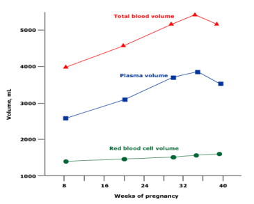

Thể tích huyết thanh bắt đầu tăng từ tuần thứ 6 và ổn định ở tuần 28 - 30. Tổng lượng huyết thanh tăng khoảng 1250 ml đến cuối thai kỳ. Sự tăng thể tích huyết thanh chủ yếu liên quan đến cân nặng của thai và số lượng thai hơn là cân nặng ban đầu của sản phụ.

_Hình "Thay đổi thể tích huyết thanh và hồng cầu trong thai kỳ"_.

Thiếu máu trong thai kỳ gây ra:

- **Với mẹ:** Tăng tỷ lệ tử vong khi sinh, băng huyết sau sinh, nhiễm trùng hậu sản....
- **Với thai:** Tăng nguy cơ sảy thai, hạn chế tăng trưởng trong tử cung, tăng tỷ lệ chết chu sinh. Thalassemia ở thai nhi có thể từ nhẹ không đe dọa đến nghiêm trọng, thậm chí tử vong sơ sinh.

## Nguyên nhân

1. Thiếu sắt và/hoặc acid folic.
2. Mất máu.
3. Tán huyết (di truyền hoặc mắc phải).

## Phân loại

Theo khuyến cáo của CDC:

- **3 tháng đầu & 3 tháng cuối:** Hb < 11 g/dL.
- **3 tháng giữa:** Hb < 10.5 g/dL.[^1]

## Tài liệu tham khảo

[^1]: Bộ môn Sản Phụ khoa, Trường Đại học Y Dược TP. Hồ Chí Minh. _Thực hành Sản Phụ khoa_. NXB Y học; 2020.
