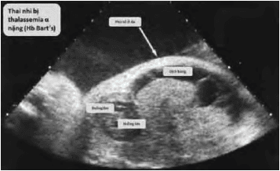

**Thalassemia** là nhóm bệnh lý thiếu máu do giảm sản xuất chọn lọc chuỗi globin trong phân tử hemoglobin. Đây là bệnh di truyền đơn gen, lặn trên nhiễm sắc thể thường theo quy luật Mendel. Ở Việt Nam hiện có khoảng 1700 trẻ sinh ra mỗi năm mắc Thalassemia. Thiếu chuỗi globin dẫn đến phân tử hemoglobin không ổn định, tan huyết và gây thiếu máu mạn tính. Mức độ nặng hay nhẹ phụ thuộc vào loại và số lượng gen bị tổn thương.

## Bệnh sinh

- **Chuỗi α-globin** do 4 gene trên NST 16 quy định; Đột biến kiểu deletion gây α-thalassemia. **Phân tử chỉ có chuỗi α (Hb Bart’s)** mất ổn định nhanh, không phóng thích O₂ → thai phù → thường tử vong trước hoặc ngay sau sinh.
- **Chuỗi β-globin** do 2 gene trên NST 11 quy định; Đột biến điểm (mutation) gây β-thalassemia. **Phân tử chỉ có chuỗi β (Hb H)** tương đối ổn định hơn → thiếu máu nhẹ/trung bình.

## Phân loại

### α-thalassemia

- **Mất 1 gene α:** Người mang gen, không có triệu chứng lâm sàng.
- **Mất 2 gene α (thể nhẹ):** Thiếu máu hồng cầu nhỏ nhược sắc nhẹ; HbA2, HbF bình thường.
- **Mất 3 gene α (Hb H):** Thiếu máu tương đối nặng; Lách to; HbA2 bình thường hoặc tăng nhẹ.
- **Mất 4 gene α (Hb Bart’s, thai phù):** Không có chuỗi α; Chỉ có chuỗi γ với ái lực O₂ cao → thai phù đa màng, suy tim, tử vong thường từ tuần 30 đến ngay sau sinh.

### β-thalassemia

- **Thể nặng (β⁰/β⁰ hoặc β⁰/β⁰ kép):** Biểu hiện sớm ngay sau sinh hoặc vài tháng tuổi. Thiếu máu nặng, vàng da, gan lách to. Cần truyền máu định kỳ và thải sắt để duy trì sự sống. Huyết học: Hb < 70 g/L; MCV, MCH giảm; Ferritin bình thường hoặc tăng; Điện di Hb: ↑ HbF, ↑ HbA2.
- **Thể trung gian (β⁺/β⁺ hoặc β⁺/β⁰):** Thiếu máu nhẹ-vừa, biểu hiện muộn hơn thể nặng. Có thể cần truyền máu từng đợt, ít phụ thuộc hơn.
- **Thể ẩn (dị hợp tử 1 đột biến):** Thường không triệu chứng; Chỉ phát hiện tình cờ khi xét nghiệm. Hb giảm nhẹ; MCV, MCH giảm; HbA2 tăng (3.5-7%); HbF 1-3% tùy loại đột biến.

## Đặc điểm

### Với mẹ

- Vỡ hồng cầu → ứ sắt, gan lách to.
- Nguy cơ nhiễm trùng tăng, nhất là sau cắt lách.
- Biến dạng xương do tủy phải tăng sinh.
- Bệnh tim do ứ sắt cơ tim → suy tim, loạn nhịp.
- Chậm phát triển tâm thần vận động do thiếu O₂ mạn tính.

### Với thai

_Thai phù trong hội chứng Hb Bart’s_.

- Thể nặng có thể không sống sót sau sinh.
- Cân nhắc tư vấn chấm dứt thai kỳ nếu phát hiện Hb Bart’s. 

## Tầm soát

- Huyết đồ: Hb < 11 g/dL; MCV < 80 fL; MCH < 27 pg.
- Định lượng ferritin: Bình thường hoặc tăng → chuyển sang điện di Hb.
- Điện di Hb: Xác định tỉ lệ HbA2, HbF để phân loại. 
- Khảo sát di truyền ở vợ và chồng → đánh giá nguy cơ thai mắc thể nặng.
- Chẩn đoán trên thai: Sinh thiết gai rau, chọc ối hoặc lấy máu cuống rốn nếu có nguy cơ cao.

_Kết quả điện di Hb ở người trưởng thành_.

## Thai phụ mắc β-thalassemia

- Điều trị đa chuyên khoa: Sản khoa, huyết học, gây mê, nữ hộ sinh.
- Duy trì Hb 10 g/dL bằng truyền máu định kỳ; Kiểm soát ferritin < 1000 ng/mL.
- Siêu âm tim, gan, tuyến giáp mỗi tam cá nguyệt.
- Sàng lọc tiểu đường: Lần đầu 16 tuần, lặp lại 24-28 tuần.
- Siêu âm đánh giá tăng trưởng thai: 24-26 tuần rồi mỗi 4 tuần.
- Acid folic 5 mg/ngày để phòng thiếu máu hồng cầu to.
- Tránh uống thêm sắt; Nếu cần thải sắt sử dụng DFO (cân nhắc nguy cơ teratogen).
- Chuyển dạ: Ưu tiên sinh thường có gây tê ngoài màng cứng; Tránh mê nội khí quản nếu có bất thường hàm mặt.
- Tránh IUD và thuốc ngừa phối hợp; Ưu tiên progesterone đơn thuần hoặc bao cao su.

## Dự phòng

- Sàng lọc mang gen trước hôn nhân hoặc mang thai.
- Chẩn đoán di truyền tiền làm tổ (PGD) trên phôi IVF để chọn phôi không mang gen bệnh.
- Lưu trữ tế bào gốc cuống rốn cho điều trị ghép tế bào gốc sau này.

## Tài liệu tham khảo

- Trường ĐH Y Dược TP. HCM (2020) - _Team-based learning_
- WHO 2021 - _Guidelines for screening and management of haemoglobinopathies_
