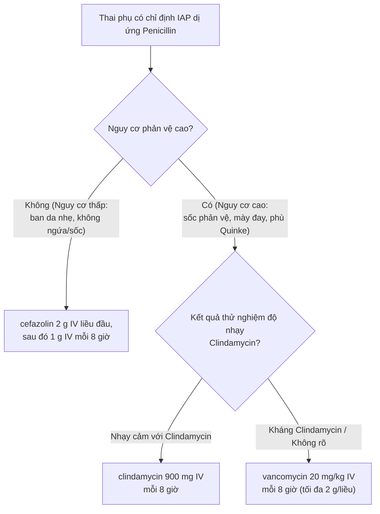

**Liên cầu khuẩn nhóm B** (_Group B Streptococcus_ - GBS, tên khoa học _Streptococcus agalactiae_) là vi khuẩn thường trú ở đường tiêu hóa dưới và đường sinh dục của phụ nữ. Mặc dù GBS thường không gây triệu chứng ở người trưởng thành khỏe mạnh, việc vi khuẩn này truyền từ mẹ sang con trong quá trình chuyển dạ có thể dẫn đến nhiễm trùng sơ sinh sớm nghiêm trọng như nhiễm trùng huyết, viêm phổi và viêm màng nổi.¹

GBS là nguyên nhân hàng đầu gây nhiễm trùng sơ sinh sớm (_Early-Onset Disease_ - EOD, xảy ra trong 6 ngày đầu sau sinh, thường gặp nhất trong 24 giờ đầu). Tỉ lệ lưu hành GBS ở đường sinh dục-tiêu hóa thai phụ dao động từ **10 - 30%**. Khi không được dự phòng bằng kháng sinh trong chuyển dạ (_Intrapartum Antibiotic Prophylaxis_ - IAP), khoảng **50%** trẻ sinh ra từ mẹ mang vi khuẩn GBS sẽ bị xâm nhiễm, và **1 - 2%** trong số trẻ bị xâm nhiễm đó sẽ phát triển thành bệnh GBS sơ sinh sớm.²

Nhờ triển khai chiến lược tầm soát diện rộng và áp dụng IAP, tỉ lệ mắc GBS sơ sinh sớm đã giảm đáng kể từ **1.7/1000** trẻ sinh sống (thập niên 1990) xuống còn khoảng **0.23/1000** trẻ sinh sống hiện nay.³

## Nguyên nhân và Cơ chế bệnh sinh

- **Tác nhân gây bệnh:** _Streptococcus agalactiae_ là vi khuẩn cầu trùng Gram dương, đứng thành chuỗi, thuộc nhóm B theo phân loại Lancefield.
- **Cơ chế lây truyền:**
  - **Lây truyền dọc:** Vi khuẩn GBS từ âm đạo/trực tràng di chuyển ngược dòng vào buồng tử cung (sau khi vỡ màng ối hoặc ngay cả khi màng ối còn nguyên) hoặc trẻ hít/nuốt phải dịch âm đạo chứa GBS khi đi qua đường sinh tự nhiên.
  - **Cơ chế gây bệnh ở trẻ sơ sinh:** Sau khi xâm nhập vào đường hô hấp hoặc tiêu hóa của thai nhi, vi khuẩn đi qua màng phế nang - mao mạch vào máu, gây nhiễm trùng huyết, viêm phổi, và có thể vượt qua hàng rào máu - não gây viêm màng não.

## Yếu tố nguy cơ

Các yếu tố làm tăng nguy cơ trẻ sơ sinh mắc GBS sớm bao gồm:

- **Tầm soát GBS dương tính:** Phết âm đạo - trực tràng dương tính với GBS ở thời điểm **36⁰/⁷ – 37⁶/⁷ tuần** thai kỳ hiện tại.
- **Nhiễm khuẩn tiết niệu do GBS:** Phát hiện vi khuẩn GBS trong nước tiểu (bất kể số lượng khuẩn lạc, ngay cả **< 10⁵ CFU/mL**) ở bất kỳ thời điểm nào của thai kỳ hiện tại.
- **Tiền sử sinh con mắc GBS:** Đã từng sinh con bị nhiễm trùng GBS xâm lấn ở lần thai trước.
- **Chuyển dạ non tháng:** Chuyển dạ hoặc vỡ màng ối ở tuổi thai **< 37⁰/⁷ tuần**.
- **Thời gian vỡ ối kéo dài:** Thời gian từ khi vỡ màng ối đến khi sinh **≥ 18 giờ**.
- **Sốt trong chuyển dạ:** Nhiệt độ cơ thể thai phụ trong chuyển dạ **≥ 38.0 °C** (**100.4 °F**).
- **Xét nghiệm NAAT/PCR trong chuyển dạ dương tính:** Kết quả khuếch đại axit nucleic phát hiện GBS khi nhập viện chuyển dạ.

## Chẩn đoán

### Lâm sàng

- **Ở thai phụ:** Hầu hết thai phụ mang vi khuẩn GBS ở dạng người lành mang trùng, hoàn toàn **không có triệu chứng lâm sàng**. Một số ít trường hợp có thể gặp nhiễm khuẩn tiết niệu (viêm màng quang, viêm đài bể thận), viêm nội mạc tử cung hoặc nhiễm trùng ối.
- **Ở trẻ sơ sinh (GBS sớm):** Xuất hiện trong vòng 24 giờ đầu sau sinh với các dấu hiệu suy hô hấp, ngừng thở, hạ thân nhiệt hoặc sốt, hạ huyết áp, li bì, bỏ bú, co giật.

### Cận lâm sàng

#### Thời điểm tầm soát GBS thai kỳ

- **Khuyến cáo của ACOG (2020):** Tất cả thai phụ nên được tầm soát GBS bằng cấy phết âm đạo - trực tràng ở thời điểm **36⁰/⁷ – 37⁶/⁷ tuần** thai kỳ (thay vì 35 – 37 tuần như hướng dẫn cũ).⁴
- **Lý do thay đổi:** Kết quả cấy GBS có giá trị dự đoán âm tính tối đa trong **5 tuần**. Việc tầm soát từ **36⁰/⁷ tuần** giúp kết quả có hiệu lực kéo dài đến **41⁶/⁷ tuần**, bao phủ hầu hết các trường hợp sinh đủ tháng và sinh muộn.

#### Kỹ thuật lấy mẫu phết âm đạo - trực tràng

- **Vị trí lấy mẫu:**
  1. Dùng tăm bông miết nhẹ vùng **1/3 dưới âm đạo** (không dùng mỏ vịt, không lau sạch dịch âm đạo trước khi lấy).
  2. Dùng chính tăm bông đó (hoặc tăm bông thứ hai) đưa qua cơ vòng hậu môn vào **trực tràng** (độ sâu khoảng 1 - 2 cm).
- **Môi trường vận chuyển:** Đặt tăm bông vào môi trường vận chuyển (như Amies hoặc Stuart) và gửi đến phòng xét nghiệm. Vi khuẩn được nuôi cấy trong môi trường tăng sinh chọn lọc (như canh thang Todd-Hewitt bổ sung kháng sinh) trước khi cấy trên thạch máu.

#### Xét nghiệm nước tiểu thai kỳ

- Mọi thai phụ cần được xét nghiệm nước tiểu ở đầu thai kỳ để phát hiện vi khuẩn niệu không triệu chứng.
- Nếu phát hiện GBS trong nước tiểu với số lượng **≥ 10⁵ CFU/mL**, thai phụ cần được điều trị nội khoa đợt cấp ngay tại thời điểm phát hiện, đồng thời **mặc định có chỉ định IAP** khi chuyển dạ mà không cần cấy phết âm đạo - trực tràng ở tuần thứ 36.
- Nếu GBS trong nước tiểu **< 10⁵ CFU/mL**, không cần điều trị kháng sinh ở giai đoạn mang thai nhưng **vẫn có chỉ định IAP** khi chuyển dạ.

#### Thử nghiệm độ nhạy kháng sinh (Kháng sinh đồ)

- Khi gửi mẫu cấy GBS của thai phụ có **tiền sử dị ứng _penicillin_**, bác sĩ phải ghi rõ trên phiếu xét nghiệm thông báo dị ứng _penicillin_ để phòng xét nghiệm thực hiện **thử nghiệm độ nhạy với _clindamycin_**.

### Chẩn đoán xác định chỉ định IAP

Thai phụ được xác định có chỉ định dự phòng kháng sinh trong chuyển dạ (IAP) khi có **bất kỳ một trong các tiêu chí** sau:

1. Kết quả cấy phết âm đạo - trực tràng dương tính với GBS ở **36⁰/⁷ – 37⁶/⁷ tuần** thai kỳ hiện tại.
2. Tiền sử có vi khuẩn GBS trong nước tiểu ở bất kỳ thời điểm nào của thai kỳ hiện tại.
3. Tiền sử sinh con bị nhiễm trùng GBS xâm lấn.
4. Không rõ tình trạng GBS khi vào chuyển dạ **VÀ** có ít nhất một yếu tố nguy cơ:
   - Sinh non (**< 37⁰/⁷ tuần**).
   - Vỡ màng ối **≥ 18 giờ**.
   - Sốt trong chuyển dạ (**≥ 38.0 °C**).
   - Xét nghiệm NAAT/PCR trong chuyển dạ dương tính với GBS.
   - Tiền sử cấy GBS dương tính ở thai kỳ trước (nguy cơ tái xâm nhiễm **~50%**; ngoại trừ trường hợp kết quả cấy thai kỳ này âm tính).

_Bảng "Chỉ định và Không chỉ định dự phòng kháng sinh trong sinh (IAP)". Nguồn: ACOG Committee Opinion No. 797 (2020)_.

| Chỉ định IAP                                                 | Không chỉ định IAP                                                                 |
| :----------------------------------------------------------- | :--------------------------------------------------------------------------------- |
| Cấy GBS âm đạo - trực tràng (+), thai **36⁰/⁷ – 37⁶/⁷ tuần** | Cấy GBS âm đạo - trực tràng (-), thai kỳ hiện tại                                  |
| Tiền sử sinh con nhiễm GBS xâm lấn                           | Mổ lấy thai chủ động khi chưa chuyển dạ và màng ối còn nguyên (dù GBS dương tính)  |
| Tiền sử nhiễm vi khuẩn niệu GBS trong thai kỳ hiện tại       | Không rõ GBS nhưng sinh đủ tháng (**≥ 37⁰/⁷ tuần**), ối vỡ **< 18 giờ**, không sốt |
| Chưa có kết quả GBS + Sinh non (**< 37⁰/⁷ tuần**)            |                                                                                    |
| Chưa có kết quả GBS + Ối vỡ **≥ 18 giờ**                     |                                                                                    |
| Chưa có kết quả GBS + Sốt trong chuyển dạ (**≥ 38.0 °C**)    |                                                                                    |
| Chưa có kết quả GBS + NAAT/PCR trong chuyển dạ (+)           |                                                                                    |

### Chẩn đoán phân biệt

- **Nhiễm trùng ối do các vi khuẩn khác:** _Escherichia coli_, _Listeria monocytogenes_, _Ureaplasma urealyticum_, vi khuẩn kỵ khí.
- **Viêm âm đạo/cổ tử cung:** Do _Candida_, _Trichomonas vaginalis_, hoặc viêm âm đạo do vi khuẩn (BV).
- **Nhiễm khuẩn tiết niệu do tác nhân khác:** _E. coli_, _Klebsiella pneumoniae_, _Proteus mirabilis_.

## Điều trị

### Nguyên tắc điều trị

- **Thời điểm khởi đầu:** Kháng sinh dự phòng IAP phải được bắt đầu ngay khi thai phụ vào chuyển dạ hoặc ngay sau khi vỡ màng ối.
- **Thời gian tối ưu:** Sử dụng kháng sinh tĩnh mạch ít nhất **4 giờ trước khi sinh** mang lại hiệu quả bảo vệ cao nhất cho trẻ. Tuy nhiên, **không hoãn các can thiệp sản khoa cần thiết hay hoãn sinh** chỉ để chờ đủ 4 giờ kháng sinh.
- **Đường dùng:** Bắt buộc dùng đường **tĩnh mạch (IV)** để đạt nồng độ kháng sinh nhanh chóng trong máu thai nhi và nước ối.

### Điều trị nội khoa (Phác đồ kháng sinh IAP)

#### Thai phụ KHÔNG dị ứng _penicillin_ (Phác đồ ưu tiên)

- **Lựa chọn thứ nhất (_penicillin G_):**
  - Liều đầu: **5 triệu đơn vị** IV.
  - Liều duy trì: **2.5 – 3.0 triệu đơn vị** IV mỗi **4 giờ** cho đến khi sinh.
- **Lựa chọn thay thế (_ampicillin_):**
  - Liều đầu: **2 g** IV.
  - Liều duy trì: **1 g** IV mỗi **4 giờ** cho đến khi sinh.

#### Thai phụ DỊ ỨNG _penicillin_

Việc lựa chọn kháng sinh dựa trên mức độ nguy cơ phản vệ với _penicillin_ và kết quả kháng sinh đồ:

_Hình "Sơ đồ phác đồ lựa chọn kháng sinh IAP dự phòng GBS cho thai phụ dị ứng penicillin". Nguồn: ACOG Committee Opinion No. 797 (2020)_.

- **Nguy cơ phản vệ THẤP** (Tiền sử phát ban da nhẹ, không mề đay, không sốc phản vệ, không phù Quincke):
  - Khuyên dùng _cefazolin_: Liều đầu **2 g** IV, sau đó **1 g** IV mỗi **8 giờ** cho đến khi sinh.
- **Nguy cơ phản vệ CAO** (Tiền sử sốc phản vệ, mày đay cấp, co thắt phế quản, phù Quincke):
  - **Nếu vi khuẩn GBS NHẠY CẢM với _clindamycin_:** Dùng _clindamycin_ **900 mg** IV mỗi **8 giờ** cho đến khi sinh.
  - **Nếu vi khuẩn GBS KHÁNG _clindamycin_ hoặc không rõ độ nhạy:** Dùng _vancomycin_ **20 mg/kg** IV mỗi **8 giờ** (tối đa **2 g** mỗi liều) cho đến khi sinh.

:::note
_Clindamycin_ không được khuyến cáo dùng để điều trị nhiễm khuẩn tiết niệu do GBS trong thai kỳ vì thuốc tập trung kém trong nước tiểu và chuyển hóa chủ yếu tại gan.
:::

:::caution
_Erythromycin_ không còn được khuyến cáo sử dụng làm kháng sinh dự phòng GBS trong chuyển dạ do tỉ lệ vi khuẩn GBS kháng thuốc cao.
:::

### Điều trị ngoại khoa

- Không có chỉ định can thiệp ngoại khoa để điều trị hoặc dự phòng tình trạng mang vi khuẩn GBS.
- Trong trường hợp mổ lấy thai chủ động khi màng ối còn nguyên và chưa vào chuyển dạ, **không cần dùng kháng sinh IAP dự phòng GBS** (tuy nhiên vẫn cần dùng kháng sinh dự phòng nhiễm trùng vết mổ theo quy trình chuẩn).

## Dự phòng và Theo dõi

### Dự phòng cấp 1 & cấp 2

- **Tầm soát hệ thống:** Đảm bảo **100% thai phụ** được thực hiện cấy phết âm đạo - trực tràng ở tuổi thai **36⁰/⁷ – 37⁶/⁷ tuần**.
- **Quản lý hồ sơ thai kỳ:** Ghi nhận rõ ràng tình trạng GBS và tiền sử dị ứng _penicillin_ (phân loại nguy cơ cao/thấp) trong sổ khám thai để chủ động phác đồ IAP ngay khi nhập viện.
- **Tư vấn bệnh nhân:** Giải thích cho thai phụ về ý nghĩa của việc tầm soát và vai trò của việc truyền kháng sinh đúng thời điểm trong chuyển dạ.

### Theo dõi trẻ sơ sinh sau sinh

Trẻ sơ sinh có mẹ mang vi khuẩn GBS cần được theo dõi sát tại khoa sơ sinh dựa trên thời gian truyền IAP của mẹ và tuổi thai:

- **Mẹ đã nhận đủ IAP (≥ 4 giờ trước sinh):** Theo dõi lâm sàng sát trong vòng **36 - 48 giờ** tại khoa sơ sinh. Nếu trẻ khỏe mạnh, không cần làm thêm xét nghiệm.
- **Mẹ nhận IAP không đủ (< 4 giờ) VÀ trẻ đủ tháng (≥ 37⁰/⁷ tuần), ối vỡ < 18 giờ:** Theo dõi lâm sàng sát trong **48 giờ**.
- **Mẹ nhận IAP không đủ (< 4 giờ) VÀ trẻ sinh non (< 37⁰/⁷ tuần) HOẶC ối vỡ ≥ 18 giờ:** Cần làm các xét nghiệm tầm soát nhiễm trùng (công thức máu, CRP) và theo dõi sát tối thiểu **48 giờ**.
- **Trẻ có dấu hiệu nghi ngờ nhiễm trùng (suy hô hấp, sốt, li bì...):** Thực hiện ngay cấy máu, chọc dò tủy sống (nếu có chỉ định) và điều trị kháng sinh toàn thân ngay lập tức.

:::danger
Nếu thai phụ có dấu hiệu nhiễm trùng ối (sốt **≥ 38.0 °C**, dịch âm đạo hôi, tử cung ấn đau, nhịp tim thai nhanh **> 160 lần/phút**), cần khởi động ngay phác đồ điều trị nhiễm trùng ối toàn thân rộng phổ (bao phủ cả GBS và vi khuẩn Gram âm) chứ không chỉ dùng phác đồ IAP đơn thuần.
:::

## Tài liệu tham khảo

1. American College of Obstetricians and Gynecologists. Prevention of group B streptococcal early-onset disease in newborns: ACOG Committee Opinion No. 797. _Obstet Gynecol_. 2020;135(2):e51-e72. doi:10.1097/AOG.0000000000003824
2. Centers for Disease Control and Prevention. Prevention of perinatal group B streptococcal disease: revised guidelines from CDC, 2010. _MMWR Recomm Rep_. 2010;59(RR-10):1-32.
3. Puopolo KM, Lynfield R, Cummings JJ, et al. Management of infants at risk for group B streptococcal disease. _Pediatrics_. 2019;144(2):e20191881. doi:10.1542/peds.2019-1881
4. Verani JR, McGee L, Schrag SJ. Prevention of perinatal group B streptococcal disease--revised guidelines from CDC, 2010. _MMWR Recomm Rep_. 2010;59(RR-10):1-36.
