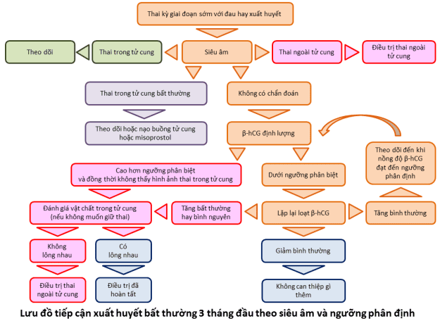

Nguyên nhân chính của xuất huyết tử cung bất thường trong 3 tháng đầu thai kỳ (không liên quan đến chấn thương) gồm:

1. Sẩy thai. Chiếm khoảng 15–20% trường hợp chảy máu 3 tháng đầu, bao gồm dọa sẩy, sẩy khó tránh, không trọn, trọn và lưu.
2. Thai ngoài tử cung. Chiếm khoảng 2% các trường hợp, thường ở vòi tử cung; vỡ có thể gây chảy máu ổ bụng nguy hiểm.
3. Bệnh nguyên bào nuôi. Gồm trứng trống (hydatidiform mole) và choriocarcinoma, thường có nồng độ β-hCG rất cao.
4. Xuất huyết do làm tổ của phôi. Thường xuất hiện 6–12 ngày sau thụ tinh, lượng máu ít, màu hồng nhạt.
5. Các nguyên nhân không do thai kỳ. Bao gồm polyp tử cung, u xơ, viêm cổ tử cung, nhiễm trùng âm đạo.

## Khai thác thông tin

### Tiền sử và bệnh sử

- Tiền sử sản khoa (số lần mang thai, diễn biến và kết cục mỗi thai kỳ, các can thiệp ngoại khoa hoặc nội khoa trước đó).
- Tiền sử sinh non. Sinh non tự phát với tuổi thai thay đổi có thể gợi ý hở eo tử cung hoặc dị dạng tử cung.
- Tiền sử sẩy thai liên tiếp. Tăng nguy cơ sẩy thai tái phát nếu chưa khảo sát di truyền, tự miễn (hội chứng kháng phospholipid) và bệnh lý tử cung.
- Tiền sử thai ngoài tử cung. Chi tiết phương pháp điều trị, di chứng nhiễm trùng hoặc phẫu thuật vùng chậu.
- Tiền sử hỗ trợ sinh sản và tránh thai. Hoặc có thai sau hỗ trợ sinh sản (nguy cơ heterotopic pregnancy), hoặc sau tránh thai khẩn cấp thất bại (tăng nguy cơ thai ngoài tử cung).
- Tiền sử kinh nguyệt. Chu kỳ gần nhất, tính chất và thời gian hành kinh để phân biệt với chảy máu cơ năng.
- Triệu chứng nghén. Nghén nặng có thể liên quan đa thai hoặc thai trứng; nghén mất đột ngột gợi ý thai lưu.

## Lâm sàng

- Khai thác tính chất xuất huyết: lượng máu, màu sắc, thời điểm khởi phát, kèm đau bụng hoặc không.
- Khám toàn thân: đánh giá huyết áp, mạch, dấu hiệu mất máu.
- Khám bụng: kiểm tra phản ứng thành bụng, đánh giá đau do xuất huyết nội.
- Khám âm đạo và cổ tử cung: xác định kích thước tử cung, tính tương thích với tuổi thai, tình trạng mở cổ tử cung, khối cạnh tử cung, túi cùng sau.
- Quan sát mô được tống ra: đánh giá mô thai, máu cục hoặc tổ chức viêm.

## Siêu âm là biện pháp tiếp cận sơ cấp

Siêu âm qua đường âm đạo (TVS) ưu thế về độ phân giải, giúp phát hiện:

1. Túi thai trong tử cung. Sự có mặt hướng tới thai trong tử cung, ngoại trừ trường hợp túi giả hoặc song thai hỗn hợp.
2. Hoạt động của phôi và túi noãn hoàng. Phôi có tim thai thường thấy từ tuần 6; túi noãn hoàng xuất hiện từ 5+1⁄2 tuần.

Nếu TVS không thấy túi thai ở tuổi siêu âm 5.5–6 tuần, cần xem xét thêm thai ngoài tử cung hoặc khảo sát bổ sung. TVS còn giúp chẩn đoán thai trứng với hình ảnh “tổ ong” và đánh giá các dạng bệnh nguyên bào nuôi.

## Định lượng β-hCG là tiếp cận thứ cấp

- Diễn biến β-hCG. Mức tăng gấp đôi sau 48 giờ ở thai bình thường.
- Ngưỡng phân định. β-hCG >1500–2000 IU/L kèm không thấy túi thai trong tử cung gợi ý thai ngoài tử cung.

Sau khi xác định túi thai có phôi và tim thai, vai trò β-hCG giảm.

_Lược đồ tiếp cận xuất huyết 3 tháng đầu với siêu âm._

## Nguồn tham khảo

- Trường ĐH Y Dược TP. HCM (2020) – _Team-based learning_
